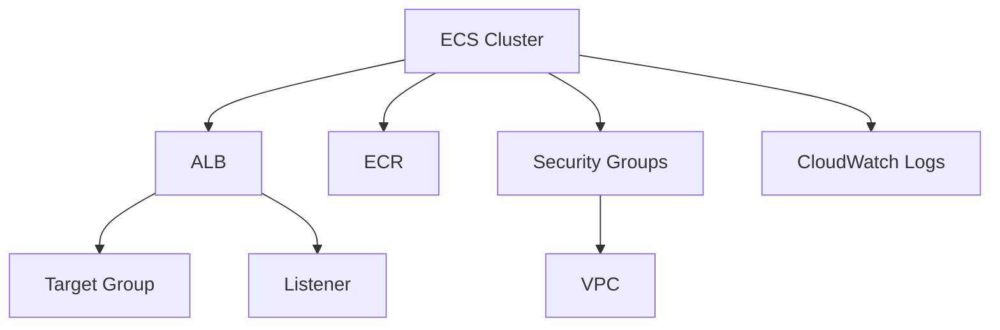

# 🐳 Módulo ECS

Este módulo implementa um cluster ECS (Elastic Container Service) completo na AWS, incluindo recursos necessários para execução de containers de forma escalável e segura.

## 📋 Visão Geral

O módulo ECS cria um ambiente completo para execução de containers, incluindo:
- Cluster ECS com Fargate
- Application Load Balancer (ALB)
- ECR (Elastic Container Registry)
- Security Groups
- CloudWatch Log Group

## 🏗️ Recursos Criados

### ECS Cluster
- Cluster Fargate
- Capacity Provider configurado
- Tags personalizadas por projeto
- Integração com CloudWatch

### Application Load Balancer (ALB)
- Balanceamento de carga HTTP/HTTPS
- Listener na porta 80
- Target Group configurado
- Health checks habilitados
- Tags personalizadas por projeto

### ECR (Elastic Container Registry)
- Repositório privado
- Lifecycle policy configurada
- Tags personalizadas por projeto
- Integração com IAM

### Security Groups
- Regras de entrada para HTTP/HTTPS
- Regras de saída para internet
- Tags personalizadas por projeto
- Integração com VPC

### CloudWatch Log Group
- Retenção de logs configurada
- Tags personalizadas por projeto
- Integração com ECS

## ⚙️ Variáveis


| Nome                      | Descrição                                         | Tipo     | Obrigatório |
|---------------------------|--------------------------------------------------|----------|-------------|
| `alb_internal`            | Define se o ALB será interno (`true`) ou público (`false`) | `bool`   | Sim         |
| `service_name`            | Nome do serviço ECS                              | `string` | Sim         |
| `cluster_name`            | Nome do cluster ECS                              | `string` | Sim         |
| `service_cpu`             | vCPU alocada para o container                    | `number` | Sim         |
| `service_memory`          | Memória alocada para o container (MB)            | `number` | Sim         |
| `service_port`            | Porta exposta pelo container                     | `number` | Sim         |
| `ecr_image_tag`           | Tag da imagem a ser usada                        | `string` | Sim         |
| `project_name`            | Nome do projeto                                  | `string` | Sim         |
| `vpc_id`                  | ID da VPC                                        | `string` | Sim         |
| `private_subnets`         | Lista de subnets privadas                        | `list`   | Sim         |
| `listiner_arn`            | ARN do listener ALB                              | `string` | Sim         |
| `host_name`               | Nome DNS do serviço (para regra no listener)     | `string` | Sim         |
| `capacity_provider_strategy` | Estratégia FARGATE/FARGATE_SPOT               | `list`   | Sim         |
## 🔒 Segurança

### Isolamento de Recursos
- Security Groups específicos para cada componente
- Controle de acesso baseado em IAM
- ECR privado com autenticação

### Monitoramento
- Logs centralizados no CloudWatch
- Health checks no ALB
- Métricas de performance

## 🔄 Dependências



## 🚀 Uso

```hcl
module "ecs" {
  source = "./modules/ecs"
  
  project_name = "meu-projeto"
  ecs_cluster_name = "meu-cluster"
  ecs_min_size = 1
  ecs_max_size = 3
  ecs_desired_capacity = 2
}
```

## 📝 Outputs

| Nome | Descrição |
|------|-----------|
| `cluster_name` | Nome do cluster ECS |
| `listiner_arn` | ARN do listener do ALB |
| `private_subnet_ids` | IDs das subnets privadas |
| `public_subnet_ids` | IDs das subnets públicas |
| `vpc_id` | ID da VPC |

## 🛠️ Manutenção

### Atualização
```bash
terraform plan
terraform apply
```

### Destruição
```bash
terraform destroy
```

## 📌 Notas Importantes

- O módulo é projetado para alta disponibilidade
- Todos os recursos são provisionados de forma idempotente
- As configurações seguem as melhores práticas da AWS
- O ALB é criado em subnets públicas
- O ECR é configurado com lifecycle policy para limpeza automática
- Os logs são retidos por 30 dias por padrão

## 🧪 Exemplo de Uso

### 🔓 Serviço Público

```hcl
module "service1" {
  source = "./modules/ecs"

  # Container configuration
  alb_internal    = false
  service_name    = "service1"
  cluster_name    = module.vpc.cluster_name
  service_cpu     = 256
  service_memory  = 512
  service_port    = 80
  ecr_image_tag   = "latest"
  project_name    = var.project_name
  vpc_id          = module.vpc.vpc_id
  private_subnets = module.vpc.private_subnet_ids
  listiner_arn    = module.vpc.public_listiner_arn
  host_name       = "service1.dev.selectsolucoes.com"


  # Capacity provider strategy
  capacity_provider_strategy = [
    {
      capacity_provider = "FARGATE"
      weight            = 70
    },
    {
      capacity_provider = "FARGATE_SPOT"
      weight            = 50
    }
  ]


  # Scaler configuration
  # CPU - APENAS ALTERE SE NECESSÁRIO 
  scale_type            = "StepScaling"
  service_desired_count = 1
  service_min_count     = 1
  service_max_count     = 5
  # UP
  scale_out_cpu_threshold       = 70
  scale_out_adjustment          = 1
  scale_out_comparison_operator = "GreaterThanOrEqualToThreshold"
  scale_out_period              = 60
  scale_out_evaluation_periods  = 1
  scale_out_cooldown            = 120
  scale_out_statistic           = "Average"
  # DOWN
  scale_in_cpu_threshold       = 60
  scale_in_adjustment          = -1
  scale_in_comparison_operator = "LessThanOrEqualToThreshold"
  scale_in_period              = 60
  scale_in_evaluation_periods  = 1
  scale_in_cooldown            = 60
  scale_in_statistic           = "Average"


  #  Health check configuration

  path_health_check = {
    healthy_threshold   = 2
    interval            = 30
    timeout             = 15
    unhealthy_threshold = 2
    path                = "/"
    port                = 80
    protocol            = "HTTP"
    matcher             = "200-399"
  }
  #  Security group rules configuration

  security_group_rules = {
    HTTPS = {
      type        = "ingress"
      from_port   = 443
      to_port     = 443
      protocol    = "tcp"
      cidr_blocks = ["0.0.0.0/0"]
    }
    HTTP = {
      type        = "ingress"
      from_port   = 80
      to_port     = 80
      protocol    = "tcp"
      cidr_blocks = ["0.0.0.0/0"]
    }
  }

  depends_on = [module.vpc]
}
```
### 🔓 Serviço Privado


```hcl
module "service1" {
  source = "./modules/ecs"

  # Container configuration
  alb_internal    = true # alterando para privado
  service_name    = "service1"
  cluster_name    = module.vpc.cluster_name
  service_cpu     = 256
  service_memory  = 512
  service_port    = 80
  ecr_image_tag   = "latest"
  project_name    = var.project_name
  vpc_id          = module.vpc.vpc_id
  private_subnets = module.vpc.private_subnet_ids
  listiner_arn    = module.vpc.private_listiner_arn # alterado para o listiner privado
  host_name       = "service1.dev.selectsolucoes.com"


  # Capacity provider strategy
  capacity_provider_strategy = [
    {
      capacity_provider = "FARGATE"
      weight            = 70
    },
    {
      capacity_provider = "FARGATE_SPOT"
      weight            = 50
    }
  ]


  # Scaler configuration
  # CPU - APENAS ALTERE SE NECESSÁRIO 
  scale_type            = "StepScaling"
  service_desired_count = 1
  service_min_count     = 1
  service_max_count     = 5
  # UP
  scale_out_cpu_threshold       = 70
  scale_out_adjustment          = 1
  scale_out_comparison_operator = "GreaterThanOrEqualToThreshold"
  scale_out_period              = 60
  scale_out_evaluation_periods  = 1
  scale_out_cooldown            = 120
  scale_out_statistic           = "Average"
  # DOWN
  scale_in_cpu_threshold       = 60
  scale_in_adjustment          = -1
  scale_in_comparison_operator = "LessThanOrEqualToThreshold"
  scale_in_period              = 60
  scale_in_evaluation_periods  = 1
  scale_in_cooldown            = 60
  scale_in_statistic           = "Average"


  #  Health check configuration

  path_health_check = {
    healthy_threshold   = 2
    interval            = 30
    timeout             = 15
    unhealthy_threshold = 2
    path                = "/"
    port                = 80
    protocol            = "HTTP"
    matcher             = "200-399"
  }
  #  Security group rules configuration

  security_group_rules = {
    HTTPS = {
      type        = "ingress"
      from_port   = 443
      to_port     = 443
      protocol    = "tcp"
      cidr_blocks = ["0.0.0.0/0"]
    }
    HTTP = {
      type        = "ingress"
      from_port   = 80
      to_port     = 80
      protocol    = "tcp"
      cidr_blocks = ["0.0.0.0/0"]
    }
  }

  depends_on = [module.vpc]
}
```